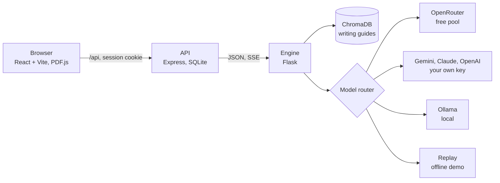

# RAGsToRiches

[](https://github.com/joshmode/RAGsToRiches/actions/workflows/ci.yml)

**Resume feedback you can check.** RAGsToRiches suggests a stronger version of each
resume bullet, grounded in writing guides it retrieves for that bullet: Google's XYZ
formula, STAR, the Rule of Three and ATS practice. It scores the resume on a fixed
rubric and checks every rewrite for claims the original doesn't make. The candidate
decides what goes in.

Built for NUS Orbital 2026 (Apollo 11). It's free, open source, and runs on a free
model tier, your own API key, a local model, or no model at all for the demo.

## Try it

You need [Docker](https://docs.docker.com/get-docker/).

```bash
docker compose up --build
```

Open <http://localhost:3000> and choose **Try a sample resume**. That runs a fictional
resume and job ad through the whole pipeline on the offline demo, which answers from
scripted responses and needs no API key. The first build takes a while because it
installs PyTorch (CPU) and bakes the embedding model into the engine image.

To analyse your own resume with a real model, copy `.env.example` to `.env` and set
`OPENROUTER_API_KEY` for the free tier. You can also add a Gemini, Claude or OpenAI key
inside the app, or point it at [Ollama](https://ollama.com) running locally.

## What it does

- **Scores the resume, not the AI.** A deterministic rubric reads only your own
  bullets: a quantified result (40), an action-verb opening (30) and clean structure
  (30), averaged per bullet. The score shows the moment the file is parsed. Accepting a
  rewrite can't inflate it; uploading a revised resume can.
- **Checks every rewrite for invented claims.** Each rewrite is checked for figures that
  aren't in the original, a bigger role than you stated ("helped with" becoming "led"),
  and job keywords your bullet doesn't support. Flagged rewrites say what they add and
  stay out of "Accept all". An optional critic model repairs invented figures, falls
  back to your original when it can't, and audits for overstated scope or credit.
- **Grounds each rewrite in its own guides.** Each bullet retrieves its three closest
  writing guides from a vector store. The guides use placeholders like `[X%]`, never
  example numbers a model could copy.
- **Uses job keywords only where you've earned them.** A job ad's keyword goes into a
  bullet only when the bullet already implies it: Python for a Flask service, CI/CD for
  a GitHub Actions setup, "code review" for "reviewed code".
- **Shows one job-fit number.** The model reads the job ad once, for its keywords,
  company and tips, and the read is cached. The fit is the share of those keywords your
  resume mentions, so it always agrees with the keyword lists beside it.
- **Keeps you moving.**
  - Progress streams from the engine, and suggestions appear batch by batch.
  - Decisions save in the background.
  - The PDF preview highlights each suggestion in the browser.
  - The same file analysed again comes from cache.
- **Builds the documents.** A tailored CV and a cover letter are generated from the
  rewrites you accepted, with a revision history, and export to PDF or DOCX.
- **Works with mentors.** A mentor opens a review session and candidates join it with a
  code. The mentor can then suggest edits to bullets, sections or cover letters, and
  discuss them in threads. The candidate accepts or dismisses each one.

## How it fits together



| Part | Where | What it owns |
|---|---|---|
| Client | `client/` | The five-tab workspace (Review, Job Fit, Documents, Progress, Mentor), the landing page and the mentor workspace. Routes are `/`, `/history` and `/attempts/:id/:tab`. |
| API | `server/` | Accounts and the session cookie, uploads keyed by file hash, analysis jobs with streamed progress, result cache, decisions, documents and their revisions, mentor sessions, feedback, notifications. |
| Engine | `*.py` | Parsing (PyMuPDF, with OCR for scans), scoring, retrieval, rewriting, the claim checks, keyword weaving, the job-description read, CV and cover-letter generation, and routing between model providers. |

An analysis, in order:

1. **Parse.** The file becomes sections and lines, two-column layouts are read column
   by column, and the score preview is computed.
2. **Plan.** Pick the bullets worth rewriting. Headings, skill lists and bullets that
   are already strong are left alone.
3. **Retrieve.** Find the three closest writing guides for each bullet.
4. **Read the job ad.** One cached model call, which rewriting waits for briefly.
5. **Offer keywords.** Give each bullet the job keywords its content already supports
   (`weaving.py`).
6. **Rewrite.** Rewrite in batches of six, matched back to their bullets by index and
   streamed to the browser as each batch lands.
7. **Check.** Look for invented figures, inflated roles and unsupported keywords, then
   run the critic if it's on.
8. **Score and save.** Score the original bullets and store the result, including which
   prompts and which model produced it.

Every model call in an analysis shares one deadline (four minutes by default). A slow
provider costs a few bullets, not the whole analysis.

## Running it without Docker

You need Python 3.12+ and Node 22+. Start each part in its own terminal:

```bash
pip install -r requirements-engine.txt
python engine_api.py
```

```bash
cd server
npm install
npm run dev
```

```bash
cd client
npm install
npm run dev
```

The engine listens on 5001, the API on 3000 and the Vite dev server on
<http://localhost:5173>, which forwards `/api` to the API.

## Tests

None of the suites needs an API key, a GPU or a model download. Model calls, the vector
store and the embedder are stubbed, and the API tests run against a stub engine.

```bash
pip install -r requirements-dev.txt
python -m pytest
python eval_claims.py
```

```bash
cd server
npm test
```

```bash
cd client
npm run lint
npm test
```

`python -m pytest` runs the engine's 359 tests. `eval_claims.py` measures the claim
checks against labelled sets (see [`eval/`](eval/README.md)): fabrication F1 is 1.00 on
the development set and 0.75 on the held-out set. The API has 50 tests and the client
33. CI runs all of them on every push and pull request, and fails if the claim checks
drop below 0.95 precision or recall on the development set.

Prompts are versioned by hash (`prompt_registry.py`). Editing one fails
`tests/test_prompt_versions.py` until the eval has been re-run and the pin updated.

## Configuration

Everything is optional for a local run. [`.env.example`](.env.example) documents every
setting. The ones most people need:

| Variable | What it does |
|---|---|
| `OPENROUTER_API_KEY` | The pooled "Default (Free)" tier. Leave it empty and the app starts on the offline demo. |
| `DEFAULT_PROVIDER` | `openrouter` (the default) or `groq` for the free tier. |
| `JWT_SECRET`, `KEY_ENCRYPTION_SECRET` | Required in production. The second encrypts users' own API keys at rest (AES-256-GCM). |
| `ALLOW_DEMO_PROVIDER`, `DEMO_MODE` | Show the offline demo in the provider list, or serve the free tier from it too. |
| `CRITIC_*` | Which model the self-correction critic uses. |
| `ANALYSIS_DEADLINE_SECONDS` | The time budget for one analysis, every retry included. |

For a public deployment with HTTPS, set `DOMAIN` and add the production and Caddy
overlays:

```bash
docker compose -f docker-compose.yml -f docker-compose.prod.yml -f docker-compose.https.yml up -d --build
```

## Security and privacy

- **Sessions:** the session is an httpOnly, SameSite=Strict cookie that no script on the
  page can read.
- **Content Security Policy:** it allows only the app's own scripts.
- **Passwords and keys:** passwords are hashed with bcrypt, and your own API keys are
  encrypted and only used for your requests.
- **Deleting data:** you can delete your account and everything in it from the account
  menu. Guest sessions and their data are deleted within a day.
- **Local models:** with a local model, your resume never leaves your machine.

## Known limits

- **Language:** the heuristics are English-only, including the verb lists, section
  headings and word forms.
- **What the rubric measures:** it scores form (figures, verbs, structure), not whether
  an achievement is impressive or true.
- **What the checks catch:** the deterministic checks cover figures, the opening verb
  and job keywords. Anything else a rewrite invents, like a tool the job ad doesn't
  mention or a wrong team size in words, relies on the critic, and a model can miss it.
  On the held-out set, the deterministic checks miss about a third of fabrications.
- **Keyword weaving:** the tables of what implies what are curated and cover common
  technical stacks. For anything else a bullet is offered no keyword rather than a wrong
  one.
- **Parsing:** tables, text boxes and three-column layouts can misread. Scanned PDFs go
  through OCR, which is slow on a CPU. The parse preview shows what was found before
  you spend an analysis on it.
- **Speed:** free-tier models are slow and rate-limited, so an analysis can take a
  minute or two.
- **Scale:** the API uses SQLite and runs as a single instance.
- **Offline demo:** it only knows the sample resume. Anything else gets cautious
  placeholder answers.
- **LinkedIn:** importing from a profile URL is limited by LinkedIn's sign-in wall. Use
  the data-export ZIP instead.

## FAQ

**Does it make up numbers?** It's told not to. A check flags any figure your original
doesn't contain, and placeholders like `[X%]` show where a number of your own belongs.

**I accepted rewrites. Why didn't my score change?** The score reads the resume you
uploaded. Export the tailored CV, upload it, and it's scored again.

**Can I use it without sending my resume to a cloud model?** Yes. Run a model with
Ollama and choose Local LLM (set `ALLOW_LOCAL_PROVIDER=true`), or use the offline demo
to see how it works.

**Why is job fit just keyword coverage?** Because it's exact, explainable and the same
everywhere it appears. The judgement calls, like tips on what to emphasise, come from
the model and are labelled as such.

## Project history

RAGsToRiches was built for NUS Orbital 2026 at the Apollo 11 level. The Milestone 3
report is in [`docs/`](docs/7656_README_Milestone3.pdf), and
[`docs/report-errata.md`](docs/report-errata.md) lists where the code has changed since.

## Team

**Joshua Andrew:** system architecture, the resume parser, the analysis engine and
retrieval pipeline, model routing and prompt engineering, Docker deployment, front-end
integration, testing and optimisation.

**Huang Sijia:** front-end development and UI design, the resume parser, the analysis
engine, feature integration, system testing, evaluation and documentation.

## License

[MIT](LICENSE) © 2026 Joshua Andrew and Huang Sijia
